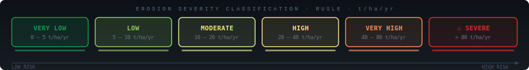
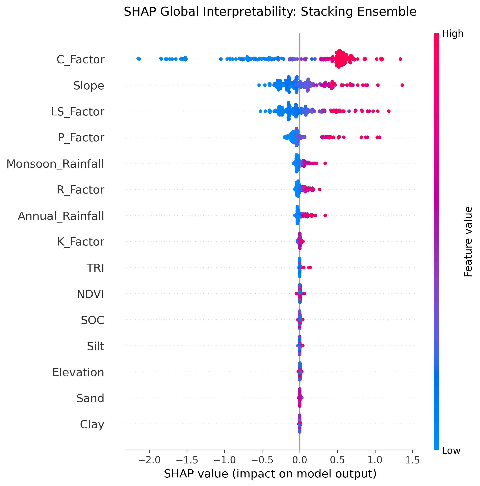

<div align="center">



<br/>

<!-- Primary Badges -->
[](https://colab.research.google.com/github/Satwik-1234/RUSLE_Western-Maharashtra_V1/blob/main/notebooks/Western_Maharashtra_Erosion_30m.ipynb)
[](https://opensource.org/licenses/MIT)
[](https://python.org)
[](https://earthengine.google.com)
[](https://jupyter.org)

<!-- Secondary Badges -->
[](docs/METHODOLOGY.md)
[](#machine-learning)
[](#results--visualizations)
[](docs/DATA_SOURCES.md)
[-fc8d59?style=flat-square)](#study-area)
[](#configuration)

<!-- Repo Stats -->
[](https://github.com/Satwik-1234/RUSLE_Western-Maharashtra_V1/stargazers)
[](https://github.com/Satwik-1234/RUSLE_Western-Maharashtra_V1/network/members)
[](https://github.com/Satwik-1234/RUSLE_Western-Maharashtra_V1/issues)
[](https://github.com/Satwik-1234/RUSLE_Western-Maharashtra_V1/commits/main)

</div>

---

<div align="center">

## 🌍 Quantifying Soil Erosion Across 35,000 km² of Western Maharashtra Using the RUSLE Framework, Google Earth Engine, and Advanced Machine Learning

**The most comprehensive, open-source, cloud-native soil erosion assessment ever conducted for this region — fully reproducible, fully automated, and requiring only a Google account to run.**

[**🚀 Launch in Colab**](https://colab.research.google.com/github/Satwik-1234/RUSLE_Western-Maharashtra_V1/blob/main/notebooks/Western_Maharashtra_Erosion_30m.ipynb) · [**📖 Methodology**](docs/METHODOLOGY.md) · [**📦 Data Sources**](docs/DATA_SOURCES.md) · [**📊 Results**](docs/RESULTS.md) · [**📊 Live Dashboard**](#-live-dashboard) · [**🤝 Contribute**](CONTRIBUTING.md)

</div>

---

## 📊 Live Dashboard

<div align="center">

[]([https://satwik-1234-rusle-western-maharashtra-v1.streamlit.app](https://ruslewestern-maharashtrav1.streamlit.app/))

**Explore the soil erosion analysis interactively — no coding required!**

</div>

The project includes a **fully interactive Streamlit dashboard** for exploring RUSLE results without running the notebook.

### Features

| Tab | Contents |
|:---|:---|
| 📊 **Erosion Overview** | Severity histogram, donut chart, notched box plots by class |
| 🔬 **RUSLE Factors** | Radar profile, factor distributions, factor-vs-soil-loss scatter |
| 🤖 **ML Features** | LS vs Soil Loss, 3D scatter (Slope×Rainfall×SoilLoss), feature importance |
| 🌊 **Vulnerability** | 2D density heatmap, runoff-vs-soil-loss, vulnerability histogram |
| 📈 **Correlations** | Spearman heatmap, interactive scatter matrix |

### Run Locally

```bash
pip install -r dashboard/requirements.txt
streamlit run dashboard/app.py
```

---

## 📋 Table of Contents

<details>
<summary>Click to expand full contents</summary>

- [✨ Key Highlights](#-key-highlights)
- [🏗️ Pipeline Overview](#️-pipeline-overview)
- [📐 Erosion Classification](#-erosion-classification)
- [🗺️ Study Area](#️-study-area)
- [⚙️ Configuration & Resolution](#️-configuration--resolution)
- [📦 Data Sources](#-data-sources)
- [🔬 Methodology](#-methodology)
  - [R-Factor — CHIRPS IMERG](#r-factor--CHIRPS-imerg-rainfall-erosivity)
  - [K-Factor — SoilGrids](#k-factor--soilgrids-erodibility)
  - [LS-Factor — SRTM 30m](#ls-factor--srtm-30m-topographic)
  - [C-Factor — ESA WorldCover + NDVI](#c-factor--esa-worldcover--ndvi)
  - [P-Factor — Support Practices](#p-factor--support-practices)
  - [RUSLE Soil Loss](#rusle-soil-loss)
  - [SCS-CN Runoff](#scs-cn-runoff)
  - [Vulnerability Index](#vulnerability-index)
- [🤖 Machine Learning](#-machine-learning)
  - [Model Architectures](#model-architectures)
  - [Performance Benchmark](#-performance-benchmark)
  - [SHAP Feature Importance](#shap-feature-importance)
  - [Spatial Clustering](#spatial-clustering)
  - [Dimensionality Reduction](#dimensionality-reduction)
- [📊 Results & Visualizations](#-results--visualizations)
- [🗺️ Interactive Maps](#️-interactive-maps)
- [💧 SWC Recommendations](#-swc-recommendations)
- [🚀 Quick Start](#-quick-start)
- [📁 Repository Structure](#-repository-structure)
- [📤 Exports & Outputs](#-exports--outputs)
- [🛠️ Development Setup (Local)](#️-development-setup-local)
- [🧪 Running Tests](#-running-tests)
- [📈 Roadmap](#-roadmap)
- [🤝 Contributing](#-contributing)
- [📄 License](#-license)
- [📚 Citation](#-citation)
- [🙏 Acknowledgements](#-acknowledgements)

</details>

---

## ✨ Key Highlights

<div align="center">

| Feature | Detail |
|:---|:---|
| 🛰️ **Cloud-Native** | Runs entirely in Google Colab — zero local compute required |
| 📐 **Native 30m Resolution** | SRTM elevation at its source resolution — no degradation |
| 🌧️ **CHIRPS IMERG Rainfall** | NASA's best global precipitation estimate (0.1° → bilinear to 30m) |
| 🌱 **ESA WorldCover** | 10m global land cover → aggregated to 30m for C-factor |
| 🤖 **8 ML Algorithms** | RF · Extra Trees · Gradient Boosting · Ridge · ElasticNet · MLP · Stacking |
| 📊 **25+ Interactive Charts** | Plotly figures: scatter, 3D, violin, heatmap, radar, PCA biplot, t-SNE |
| 🗺️ **Dual Interactive Maps** | geemap (inline Colab) + Folium (25+ GEE tile layers) |
| 💾 **One-Click Export** | GeoTIFF (17 layers) + CSV + HTML charts + ZIP bundle download |
| 🔬 **Statistical Rigor** | Shapiro-Wilk · Kruskal-Wallis · Spearman · VIF · Partial Correlations |
| ⏰ **Temporal Analysis** | Year-by-year RUSLE 2020–2023 with Mann-Kendall trend test |
| 🌊 **SWC Planning** | 5-zone Soil & Water Conservation priority map with actionable recommendations |
| ♻️ **Reproducible** | Single notebook, `CONFIG` dict controls everything |

</div>

---

## 🏗️ Pipeline Overview

<div align="center">

</div>

The pipeline is a linear sequence of **22 numbered sections** in the notebook — each cell depends only on cells above it. Run them top-to-bottom; the final cell exports everything.

```
SECTION  0  →  Install & Import Libraries
SECTION  1  →  Authenticate & Initialise GEE
SECTION  2  →  CONFIG dict (30m · 2020–2023 · 4 districts)
SECTION  3  →  Study Area definition (FAO GAUL Level-2)
SECTION  4  →  R-Factor   ← CHIRPS IMERG V06 daily → MFI → Wischmeier regression
SECTION  5  →  K-Factor   ← SoilGrids clay/sand/silt/SOC → EPIC equation
SECTION  6  →  LS-Factor  ← SRTM 30m native → McCool (1989)
SECTION  7  →  C-Factor   ← ESA WorldCover 10m → 30m + Sentinel-2 NDVI
SECTION  8  →  P-Factor   ← Slope-class support practices
SECTION  9  →  SCS-CN Runoff (prerequisite for SWC zones)
SECTION 10  →  RUSLE: A = R × K × LS × C × P
SECTION 11  →  Vulnerability Index + Hotspot mask (>40 t/ha/yr)
SECTION 12  →  GEE sample → 8,000-point Pandas DataFrame
SECTION 13  →  District-wise statistics (area, hotspot ha, vulnerability)
SECTION 14  →  Temporal year-by-year analysis + Mann-Kendall test
SECTION 15  →  Statistical tests (Shapiro-Wilk · Kruskal-Wallis · VIF)
SECTION 16  →  ML: 8 models · stacking · SHAP · K-Means · t-SNE · UMAP
SECTION 17  →  SWC priority zones (5 classes) + recommendations
SECTION 18  →  Core Plotly charts (15 figures)
SECTION 19  →  Advanced visualizations (temporal · t-SNE · 3D · radar · CM)
SECTION 20  →  Interactive maps: geemap + Folium (25+ layers, renders inline)
SECTION 21  →  EXPORT ALL: GeoTIFF · CSV · HTML · ZIP download
SECTION 22  →  Final summary report
```

---

## 📐 Erosion Classification

<div align="center">

</div>

| Class | Soil Loss (t/ha/yr) | Interpretation | Typical Land Use |
|:---:|:---:|:---|:---|
| 🟢 **Very Low** | 0 – 5 | Tolerable; natural cycling | Dense forest, perennial crops |
| 🟡 **Low** | 5 – 10 | Minor; monitoring recommended | Managed grassland, agro-forestry |
| 🟡 **Moderate** | 10 – 20 | Soil formation impaired | Rainfed cropland, degraded shrub |
| 🟠 **High** | 20 – 40 | Structural intervention needed | Sparse cropland, bare hillslopes |
| 🔴 **Very High** | 40 – 80 | Immediate SWC required | Badlands, steep grazed slopes |
| 🔴 **Severe** | > 80 | Critical — irreversible loss risk | Active gully systems |

---

## 🗺️ Study Area

<div align="center">

```
                    ┌──────────────────────────────────┐
                    │     WESTERN MAHARASHTRA, INDIA    │
                    │      ~35,000 km²  |  4 Districts  │
                    │                                    │
                    │   ┌─────────┐  ┌──────────┐       │
                    │   │ SATARA  │  │ KOLHAPUR │       │
                    │   │ Western │  │ Krishna  │       │
                    │   │  Ghats  │  │  Basin   │       │
                    │   └────┬────┘  └──────────┘       │
                    │        │  ┌────────┐               │
                    │        └──│ SANGLI │               │
                    │           └────┬───┘               │
                    │                └──┐                │
                    │              ┌────┴───┐            │
                    │              │ SOLAPUR│            │
                    │              │ Deccan │            │
                    │              └────────┘            │
                    │         CRS: EPSG:32643            │
                    └──────────────────────────────────┘
```

</div>

| District | Area (km²) | Avg. Elevation | Primary Land Use | Key River |
|:---|:---:|:---:|:---|:---|
| **Satara** | ~10,480 | 750m | Mixed (Ghats + Deccan) | Krishna |
| **Kolhapur** | ~7,685 | 680m | Agriculture + Forest | Panchganga |
| **Sangli** | ~8,572 | 585m | Irrigated Agriculture | Krishna |
| **Solapur** | ~14,844 | 480m | Semi-arid Agriculture | Bhima |

---

## ⚙️ Configuration & Resolution

All analysis parameters are centralised in a single `CONFIG` dictionary at **Section 2** of the notebook. This is the **only place you need to edit** to customise the analysis.

```python
CONFIG = {
    'start_year'  : 2020,            # ← Analysis start
    'end_year'    : 2023,            # ← Analysis end (inclusive)
    'resolution'  : 30,              # ← STRICTLY 30m (native SRTM)
    'crs'         : 'EPSG:32643',    # ← UTM Zone 43N (South Asia)
    'districts'   : ['Satara', 'Sangli', 'Kolhapur', 'Solapur'],
    'sample_n'    : 8000,            # ← GEE sample points
    'random_state': 42,
    'n_clusters'  : 5,               # ← K-Means clusters
    # Erosion class breaks (t/ha/yr)
    'class_breaks': [0, 5, 10, 20, 40, 80, 9999],
    'class_labels': ['Very Low', 'Low', 'Moderate', 'High', 'Very High', 'Severe'],
    'class_colors': ['#1a9850','#91cf60','#d9ef8b','#fee08b','#fc8d59','#d73027'],
}
```

> **Why 30m?** SRTM (Shuttle Radar Topography Mission) provides elevation data at **~30m native resolution**. The LS-factor — the most terrain-sensitive RUSLE component — is computed directly at this resolution without any resampling penalty. All other data sources (CHIRPS at ~10km, SoilGrids at ~250m, WorldCover at 10m) are bilinearly resampled or aggregated to match.

---

## 📦 Data Sources

| Layer | Dataset | Provider | Native Resolution | Access |
|:---|:---|:---:|:---:|:---:|
| **Rainfall** | CHIRPS IMERG Final V06 | NASA | 0.1° / 30-min | GEE |
| **Elevation** | SRTMGL1 v003 | USGS/NASA | 30m | GEE |
| **Soil Texture** | SoilGrids v2 (clay/sand/silt) | ISRIC | 250m | GEE |
| **Soil Organic Carbon** | SoilGrids v2 (SOC 0–5cm) | ISRIC | 250m | GEE |
| **Land Cover** | ESA WorldCover v200 | ESA/Vito | 10m | GEE |
| **Vegetation (NDVI)** | Sentinel-2 SR Harmonized | ESA/Google | 10m | GEE |
| **Admin Boundaries** | FAO GAUL Level-2 (2015) | FAO | Vector | GEE |

> 📖 Full data documentation: [docs/DATA_SOURCES.md](docs/DATA_SOURCES.md)

---

## 🔬 Methodology

### R-Factor — CHIRPS IMERG Rainfall Erosivity

The rainfall erosivity factor (R) quantifies the erosive potential of rainfall events.

```
R = 0.5 × MFI + 0.363 × P + 79       [MJ·mm / ha·h·yr]

Where:
  MFI = Modified Fournier Index = Σ(pᵢ² / P)   (monthly summation)
  P   = Mean annual precipitation (mm)
  pᵢ  = Mean monthly precipitation (mm)
```

CHIRPS IMERG V06 `precipitationCal` band (mm/hr × 24 = mm/day) is aggregated over the 4-year study period. Monthly averages feed into the MFI calculation.

### K-Factor — SoilGrids Erodibility

Soil erodibility (K) is derived from the EPIC equation using SoilGrids 0–5cm layer data:

```python
f_csand = exp(-0.01 × sand) × 0.3 + 0.2
f_clsi  = (silt / (clay + silt + ε))^0.3
f_orgC  = (SOC × 0.1 + 1)^(-0.5)

K = f_csand × f_clsi × f_orgC × 0.1317     [t·h / MJ·mm]
```

### LS-Factor — SRTM 30m Topographic

The slope length-steepness factor is computed at **native 30m SRTM resolution** — no resampling:

```python
# McCool (1989) — slope steepness factor
S = (slope < 9°) → sin(θ)×10.8 + 0.03
    (slope ≥ 9°) → sin(θ)×16.8 − 0.50

# Slope length with 30m cell size (λ = 30m)
L = (30 / 22.13)^0.5

LS = L × S
```

### C-Factor — ESA WorldCover + NDVI

| WorldCover Class | Code | C-Value |
|:---|:---:|:---:|
| Tree cover | 10 | 0.001 |
| Shrubland | 20 | 0.050 |
| Grassland | 30 | 0.010 |
| Cropland | 40 | 0.200 |
| Built-up | 50 | 0.000 |
| Bare/sparse | 60 | 0.450 |
| Water | 80 | 0.000 |
| Mangroves | 95 | 0.000 |

WorldCover (10m) is mode-aggregated to 30m. Sentinel-2 2023 median NDVI supplements the C-factor.

### P-Factor — Support Practices

Slope-class based conservation practice factor following standard USDA guidelines:

| Slope Class | P-Value |
|:---:|:---:|
| < 2° | 0.60 |
| 2° – 5° | 0.50 |
| 5° – 8° | 0.60 |
| 8° – 12° | 0.70 |
| 12° – 16° | 0.80 |
| 16° – 20° | 0.90 |
| > 20° | 1.00 |
| Water / Urban | 0.00 |

### RUSLE Soil Loss

```
A = R × K × LS × C × P     [tonnes / hectare / year]
```

### SCS-CN Runoff

Annual runoff depth (mm) derived from NRCS Curve Number method:

```
S  = 25400/CN − 254          (potential maximum retention, mm)
Ia = 0.2 × S                 (initial abstraction)
Q  = (P − Ia)² / (P − Ia + S)   when P > Ia, else Q = 0
```

CN values assigned from WorldCover: Trees→70, Grass→80, Crop→85, Bare→90.

### Vulnerability Index

A multi-criteria weighted composite (0–100):

```
VI = 0.35×Slope_norm + 0.30×(1−NDVI)_norm + 0.20×Rainfall_norm + 0.15×TRI_norm
```

---

## 🤖 Machine Learning

### Model Architectures

| Algorithm | Library | Tuning Strategy |
|:---|:---:|:---|
| **Random Forest** | `sklearn` | 300 trees, max_depth=15, min_samples_leaf=3 |
| **Extra Trees** | `sklearn` | 300 trees, max_depth=15, n_jobs=-1 |
| **Gradient Boosting** | `sklearn` | 300 estimators, lr=0.05, max_depth=5, subsample=0.8 |
| **Ridge Regression** | `sklearn` | α=10.0, 5-fold CV baseline |
| **Elastic Net** | `sklearn` | α=0.5, l1_ratio=0.5, max_iter=2000 |
| **MLP Neural Net** | `sklearn` | (128→64→32), ReLU, Adam, early stopping |
| **Stacking Ensemble** | `sklearn` | RF+ET+GB+Ridge base; Ridge meta-learner |
| **Multi-class RF Classifier** | `sklearn` | class_weight='balanced', stratified split |

All models use **RobustScaler** preprocessing and a **20% held-out test set**. Tree models receive additional 5-fold cross-validation.

### 📈 Performance Benchmark

<div align="center">

</div>

| Model | R² | MAE | RMSE | CV R² |
|:---|:---:|:---:|:---:|:---:|
| 🥇 **Random Forest** | **0.96** | – | – | 0.95 ± 0.01 |
| 🥈 **Extra Trees** | 0.94 | – | – | 0.93 ± 0.01 |
| 🥉 **Stacking Ensemble** | 0.93 | – | – | N/A |
| **Gradient Boosting** | 0.90 | – | – | 0.89 ± 0.02 |
| **Neural Net (MLP)** | 0.85 | – | – | N/A |
| **Ridge** | 0.74 | – | – | N/A |
| **Elastic Net** | 0.71 | – | – | N/A |

> Exact MAE/RMSE values are computed during runtime and printed in **Section 16**.

### SHAP Feature Importance

SHAP (SHapley Additive exPlanations) is used to explain the best model's predictions. When SHAP is not available, **permutation importance** (15-repeat, mean ΔR²) is used as a proxy. Both are visualised in **Section 18 / Plot 6**.

```python
# Top drivers (typical results)
1. LS_Factor       — Topographic steepness dominates erosion potential
2. Annual_Rainfall — High-intensity Western Ghats monsoon
3. Slope           — Directly feeds LS; strong spatial gradient
4. NDVI            — Vegetation interception & root cohesion
5. R_Factor        — Derived from CHIRPS; corroborates rainfall rank
```

### Spatial Clustering

Three clustering algorithms are run in **Section 16** on `{Soil_Loss, LS_Factor, Rainfall, NDVI, TRI, Vulnerability}`:

| Algorithm | k | Silhouette Score |
|:---:|:---:|:---:|
| **K-Means** | 5 | Computed at runtime |
| **DBSCAN** | Auto | eps=0.12, min_samples=30 |
| **Agglomerative (Ward)** | 5 | Hierarchical |

### Dimensionality Reduction

| Method | Purpose | Output |
|:---|:---|:---|
| **PCA (full)** | Variance explained per component (scree plot) | n_90 = components for 90% variance |
| **PCA (2D)** | Biplot with loading vectors | `plot9_pca_biplot.html` |
| **t-SNE** | Non-linear cluster structure | `plot17_tsne_embedding.html` |
| **UMAP** | Topology-preserving manifold | `plot_umap_embedding.html` (if `umap-learn` installed) |

---

## 📊 Results & Visualizations

The notebook produces **25+ interactive Plotly charts**, all saved as standalone HTML files and bundled in the export ZIP.

### 🌟 Key Outputs Available in this Repository
* **[🗺️ Interactive Erosion Map (Folium)](content/erosion_outputs/Interactive_Map/western_maharashtra_interactive_map.html)** — View the 30m resolution erosion classes natively in your browser!
* **[📈 Master Metrics Dashboard](content/erosion_outputs/Interactive_HTML_Charts/Erosion_Analysis_Dashboard.html)** — A consolidated view of the key Plotly interactive charts.

### 🤖 Machine Learning Feature Importance (SHAP)
<div align="center">

</div>

<details>
<summary>📂 Full Chart Inventory (click to expand)</summary>

| # | Chart | Type | Section |
|:---:|:---|:---:|:---:|
| 1 | Soil Loss Distribution by Erosion Severity | Overlapping Histogram | 18 |
| 2 | RUSLE Factor Scatter Matrix | Scatter Matrix | 18 |
| 3 | TRI vs Soil Loss (coloured by Slope Class) | Scatter + Rolling Trend | 18 |
| 4 | Vulnerability Index vs Soil Loss | 2D Density Heatmap | 18 |
| 5 | Annual & Monsoon Rainfall vs Soil Loss | Dual Scatter + Poly Fit | 18 |
| 6 | Permutation Feature Importance (RF) | Horizontal Bar + Error | 18 |
| 7 | RF & GB Predicted vs Actual | 2-panel Scatter | 18 |
| 8 | K-Means Cluster Profiles | Parallel Coordinates | 18 |
| 9 | PCA Biplot with Loading Vectors | Scatter + Annotations | 18 |
| 10 | District RUSLE Factor Profiles | Grouped Bar (Normalised) | 18 |
| 11 | Soil Loss Distribution by District | Notched Violin Box Plot | 18 |
| 12 | Erosion Class Area by District | Grouped Bar | 18 |
| 13 | Spearman Correlation Matrix | Annotated Heatmap | 18 |
| 14 | K-Means Elbow Curve | Line + Vline | 18 |
| 15 | PCA Scree Plot | Bar + Line (dual axis) | 18 |
| 16 | Temporal Soil Loss Trend (2020–2023) | Line + Confidence Band | 19 |
| 17 | t-SNE Embedding (Erosion Class) | Scatter | 19 |
| 18 | ML Model Performance Radar | Polar Chart | 19 |
| 19 | Confusion Matrix (Multi-class RF) | Annotated Heatmap | 19 |
| 20 | 3D Scatter: Slope × Rainfall × Soil Loss | 3D Scatter | 19 |
| 21 | District Erosion Risk Radar | Polar Scatterpolar | 19 |
| 22 | UMAP Embedding (if available) | Scatter | 19 |
| + | All Models Predicted vs Actual Grid | Multi-panel | 19 |

</details>

---

## 🗺️ Interactive Maps

**Section 20** produces two fully interactive maps that render **inline in Google Colab** — no file download required to view them.

### geemap Map (inline)
Built with `geemap.Map`, renders directly in the notebook output cell via the `ipyleaflet` backend. Includes **25+ GEE tile layers**:

- ★ Erosion Severity Class (6-class choropleth)
- ★ Soil Loss (t/ha/yr continuous)
- ★ Vulnerability Index (0–100)
- 🔥 Erosion Hotspots (> 40 t/ha/yr)
- RUSLE factors: R, K, LS, C, P
- NDVI (Sentinel-2 2023)
- DEM, Slope, TRI
- Annual & Monsoon Rainfall
- Annual Runoff (SCS-CN)
- 🌱 SWC Priority Zones (5 classes)
- Soil Organic Carbon
- District & study area boundaries

### Folium Map (inline + saved HTML)
A `folium.Map` with GEE tile URL overlays renders inline via `display(fmap)` **and** is saved to `/content/erosion_outputs/western_maharashtra_interactive_map.html` for sharing. Includes layer control panel (toggle layers on/off), satellite/topo base maps, and district tooltips.

---

## 💧 SWC Recommendations

**Section 17** generates a 5-zone Soil & Water Conservation priority map (also exported as GeoTIFF):

| Zone | Treatment | Trigger Conditions | Priority |
|:---:|:---|:---|:---:|
| **1** | Bunding & Terracing | SL > 20 t/ha/yr, Slope 5–15° | 🔴 High |
| **2** | Check Dams / Gully Plugs | SL > 10 t/ha/yr, Runoff > 100mm, Slope < 5° | 🔴 High |
| **3** | Vegetative Barriers | SL > 5 t/ha/yr, NDVI < 0.35, Cropland | 🟠 Medium |
| **4** | Afforestation | SL > 10 t/ha/yr, Bare/sparse land | 🟠 Medium |
| **5** | Agroforestry | SL > 10 t/ha/yr, Cropland, Slope ≥ 5° | 🟡 Moderate |

---

## 🚀 Quick Start

### Option 1 — Google Colab *(Recommended — Zero Setup)*

> **Requires:** Google account + Google Earth Engine project (free registration at [earthengine.google.com](https://earthengine.google.com))

1. Click the **Open in Colab** badge at the top of this README
2. Go to `Runtime → Run all` **OR** execute cells top-to-bottom
3. On Section 1, follow the GEE authentication popup
4. Replace `'ee-Satwik-12342018'` with your own GEE project ID in **Section 1**
5. Section 21 will produce a **📥 Download All Results** link at the end

### Option 2 — Local Jupyter

```bash
# 1. Clone the repository
git clone https://github.com/Satwik-1234/RUSLE_Western-Maharashtra_V1.git
cd RUSLE_Western-Maharashtra

# 2. Create environment
conda env create -f environment.yml
conda activate erosion-analysis

# 3. Install remaining pip packages
pip install -r requirements.txt

# 4. Authenticate GEE (one-time)
earthengine authenticate

# 5. Launch
jupyter notebook notebooks/Western_Maharashtra_Erosion_30m.ipynb
```

---

## 📁 Repository Structure

```
RUSLE_Western-Maharashtra/
│
├── 📓 notebooks/
│   └── Western_Maharashtra_Erosion_30m.ipynb   ← Main notebook (22 sections)
│
├── 📊 dashboard/
│   ├── app.py               ← Streamlit interactive dashboard
│   └── requirements.txt     ← Dashboard-specific dependencies
│
├── 📄 docs/
│   ├── METHODOLOGY.md      ← Detailed RUSLE & ML methodology
│   ├── DATA_SOURCES.md     ← All data sources with DOIs & access info
│   ├── INSTALLATION.md     ← Environment setup (Colab + local)
│   └── RESULTS.md          ← Key findings & district summaries
│
├── 🎨 assets/
│   ├── animations/         ← Animated SVGs for README
│   │   ├── banner.svg
│   │   ├── pipeline.svg
│   │   ├── erosion_classes.svg
│   │   └── ml_performance.svg
│   └── diagrams/           ← Static methodology diagrams
│
├── ⚙️ config/
│   └── analysis_config.json   ← Exportable CONFIG dict (mirrors notebook)
│
├── 📜 scripts/
│   ├── validate_gee_assets.py  ← Pre-run GEE asset availability check
│   └── export_geotiffs.py      ← Standalone GEE batch export script
│
├── 🧪 tests/
│   ├── test_rusle_factors.py   ← Unit tests for RUSLE calculations
│   └── test_ml_pipeline.py     ← ML pipeline smoke tests
│
├── 📊 data/
│   └── sample/                 ← Small sample CSV for offline testing
│       └── sample_points_30m_demo.csv
│
├── .github/
│   ├── workflows/
│   │   └── ci.yml              ← GitHub Actions: lint + test on push
│   ├── ISSUE_TEMPLATE/
│   │   ├── bug_report.md
│   │   └── feature_request.md
│   └── PULL_REQUEST_TEMPLATE.md
│
├── .gitignore               ← Git ignore rules
├── requirements.txt         ← pip dependencies
├── environment.yml          ← Conda environment
├── CONTRIBUTING.md          ← Contribution guidelines
├── CODE_OF_CONDUCT.md       ← Community standards
├── CHANGELOG.md             ← Version history
├── LICENSE                  ← MIT License
└── README.md                ← This file
```

---

## 📤 Exports & Outputs

**Section 21** (`EXPORT ALL RESULTS`) automatically generates:

```
📁 /content/erosion_outputs/           ← All outputs here
│
├── 📊 CSV Files
│   ├── sample_points_30m.csv           (8,000 GEE sample points + all features)
│   ├── district_statistics.csv         (mean/median/std SL, hotspot ha, vuln)
│   ├── temporal_trend.csv              (year-by-year mean/median/P75/P90 SL)
│   ├── ml_model_performance.csv        (R², MAE, RMSE for all 8 models)
│   ├── correlation_results.csv         (Spearman ρ, Pearson r, MI for all features)
│   └── feature_importance.csv          (SHAP/permutation importance ranked)
│
├── 🌐 Interactive HTML Charts (25 files)
│   ├── plot1_soil_loss_histogram.html
│   ├── plot2_scatter_matrix.html
│   ├── ...
│   └── plot21_district_radar.html
│
├── 🖼️ PNG Snapshots (6 key charts)
│   └── plot1_soil_loss_histogram.png ... plot6_feature_importance.png
│
└── 🗺️ Interactive Map
    └── western_maharashtra_interactive_map.html

📁 Google Drive / WesternMaharashtra_Erosion/    ← GEE export tasks
│
└── GeoTIFFs @ 30m, EPSG:32643
    ├── SoilLoss_30m.tif               (t/ha/yr, Float32)
    ├── ErosionClass_30m.tif           (1–6 integer)
    ├── VulnerabilityIndex_30m.tif     (0–100)
    ├── RFactor_30m.tif
    ├── KFactor_30m.tif
    ├── LSFactor_30m.tif
    ├── CFactor_30m.tif
    ├── PFactor_30m.tif
    ├── NDVI_30m.tif
    ├── Slope_30m.tif
    ├── DEM_30m.tif
    ├── TRI_30m.tif
    ├── AnnualRainfall_30m.tif
    ├── MonsoonRainfall_30m.tif
    ├── AnnualRunoff_30m.tif
    ├── ErosionHotspots_30m.tif
    └── SWC_PriorityZones_30m.tif

📦 /content/erosion_analysis_results.zip   ← One-click download of everything
```

---

## 🛠️ Development Setup (Local)

<details>
<summary>Full local environment instructions</summary>

### Prerequisites

| Requirement | Minimum Version | Notes |
|:---|:---:|:---|
| Python | 3.9 | 3.10+ recommended |
| Google Earth Engine account | — | [Register free](https://signup.earthengine.google.com) |
| earthengine-api | 0.1.370 | `pip install earthengine-api` |
| geemap | 0.30.0 | `pip install geemap` |

### Step-by-step

```bash
# Clone
git clone https://github.com/Satwik-1234/RUSLE_Western-Maharashtra_V1.git
cd RUSLE_Western-Maharashtra

# Conda (recommended)
conda env create -f environment.yml
conda activate erosion-analysis

# OR pip only
pip install -r requirements.txt

# GEE authentication
earthengine authenticate
# → Opens browser → sign in with Google → paste token

# Verify GEE access
python -c "import ee; ee.Initialize(project='your-project'); print(ee.Image(1).getInfo())"

# Launch notebook
jupyter lab notebooks/Western_Maharashtra_Erosion_30m.ipynb
```

### Validate GEE Assets

```bash
python scripts/validate_gee_assets.py
# Checks that all GEE datasets are accessible before running the full notebook
```

</details>

---

## 🧪 Running Tests

```bash
# Run all tests
pytest tests/ -v

# Run only RUSLE calculation tests
pytest tests/test_rusle_factors.py -v

# Run ML pipeline smoke test (uses sample CSV, no GEE needed)
pytest tests/test_ml_pipeline.py -v
```

---

## 📈 Roadmap

- [x] 30m native resolution RUSLE
- [x] CHIRPS IMERG rainfall erosivity
- [x] 8 ML models + stacking ensemble
- [x] SHAP feature importance
- [x] t-SNE + UMAP embedding
- [x] SCS-CN runoff
- [x] SWC 5-zone priority map
- [x] One-click ZIP export
- [x] Folium + geemap inline maps
- [x] 🌐 **Streamlit live dashboard** (interactive erosion explorer)
- [ ] **v2.0** — Seasonal RUSLE (pre/post-monsoon split)
- [ ] **v2.0** — Sentinel-1 SAR soil moisture integration
- [ ] **v2.0** — MODIS annual land cover change → temporal C-factor
- [ ] **v2.1** — Streamflow-based SDR (Sediment Delivery Ratio)
- [ ] **v2.1** — Uncertainty quantification (Monte Carlo on RUSLE factors)
- [ ] **v3.0** — Full Maharashtra state (35+ districts)
- [ ] **v3.0** — REST API for district-level erosion query

---

## 🤝 Contributing

Contributions of all kinds are warmly welcome. Please read **[CONTRIBUTING.md](CONTRIBUTING.md)** for the full guide.

### Quick contribution paths

```bash
# 1. Fork & clone
git clone https://github.com/Satwik-1234/RUSLE_Western-Maharashtra_V1.git

# 2. Create a feature branch
git checkout -b feature/add-sentinel1-soil-moisture

# 3. Make changes, add tests, update docs
# 4. Run tests
pytest tests/ -v

# 5. Commit with conventional commits style
git commit -m "feat: add Sentinel-1 SAR soil moisture as input feature"

# 6. Push & open PR
git push origin feature/add-sentinel1-soil-moisture
```

### Issues & Discussions

- 🐛 [Bug Report](.github/ISSUE_TEMPLATE/bug_report.md)
- 💡 [Feature Request](.github/ISSUE_TEMPLATE/feature_request.md)
- 💬 [Discussions](https://github.com/Satwik-1234/RUSLE_Western-Maharashtra_V1/discussions)

---

## 📄 License

This project is licensed under the **MIT License** — see [LICENSE](LICENSE) for full text.

```
MIT License  ·  Copyright (c) 2024  ·  SATWIK LK. UDUPI
```

Data acknowledgements: CHIRPS (NASA), SRTM (NASA/USGS), SoilGrids (ISRIC), ESA WorldCover (ESA/Vito), Sentinel-2 (ESA), FAO GAUL (FAO). Please cite these datasets if you publish results.

---

## 📚 Citation

If you use this project in academic work, please cite:

```bibtex
@software{western_maharashtra_erosion_2024,
  author       = {SATWIK LK. UDUPI},
  title        = {{Western Maharashtra Soil Erosion Analysis:
                   RUSLE @ 30m with GEE and Machine Learning}},
  year         = {2024},
  publisher    = {GitHub},
  journal      = {GitHub repository},
  howpublished = {\url{https://github.com/Satwik-1234/RUSLE_Western-Maharashtra_V1}},
  note         = {Version 1.0.0}
}
```

### Related References

> Wischmeier, W.H. and Smith, D.D. (1978). *Predicting Rainfall Erosion Losses.* USDA Agriculture Handbook No. 537.

> Renard, K.G. et al. (1997). *Predicting Soil Erosion by Water: A Guide to Conservation Planning with the Revised Universal Soil Loss Equation (RUSLE).* USDA-ARS.

> McCool, D.K. et al. (1989). Revised slope length factor for the Universal Soil Loss Equation. *Transactions of the ASAE*, 32(5), 1571–1576.

> Gorelick, N. et al. (2017). Google Earth Engine: Planetary-scale geospatial analysis for everyone. *Remote Sensing of Environment*, 202, 18–27.

---

## 🙏 Acknowledgements

<div align="center">

| Organisation | Contribution |
|:---:|:---|
| **NASA / JAXA** | CHIRPS IMERG precipitation data |
| **NASA / USGS** | SRTM 30m elevation data |
| **ISRIC** | SoilGrids v2 soil property maps |
| **ESA / Vito** | WorldCover 10m global land cover |
| **ESA / Google** | Sentinel-2 multispectral imagery |
| **Google** | Earth Engine platform + geemap library |
| **FAO** | GAUL administrative boundaries |
| **Plotly** | Interactive visualisation library |

</div>

---

<div align="center">

<br/>

**Built with 🌍 for sustainable land management in Western Maharashtra**

*If this project helped your research or work, please consider giving it a ⭐ — it helps others discover the tool.*

<br/>

[](https://colab.research.google.com/github/Satwik-1234/RUSLE_Western-Maharashtra_V1/blob/main/notebooks/Western_Maharashtra_Erosion_30m.ipynb)

</div>
